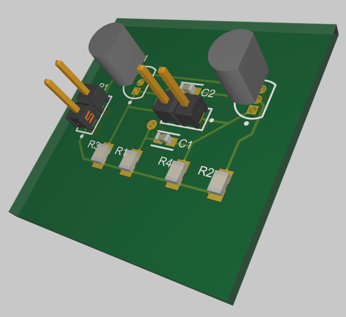
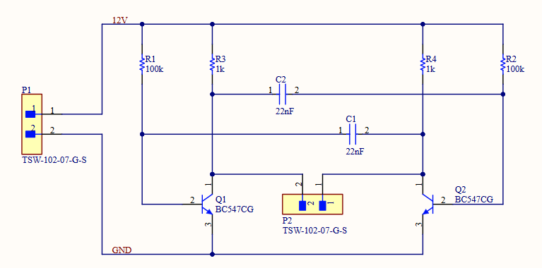
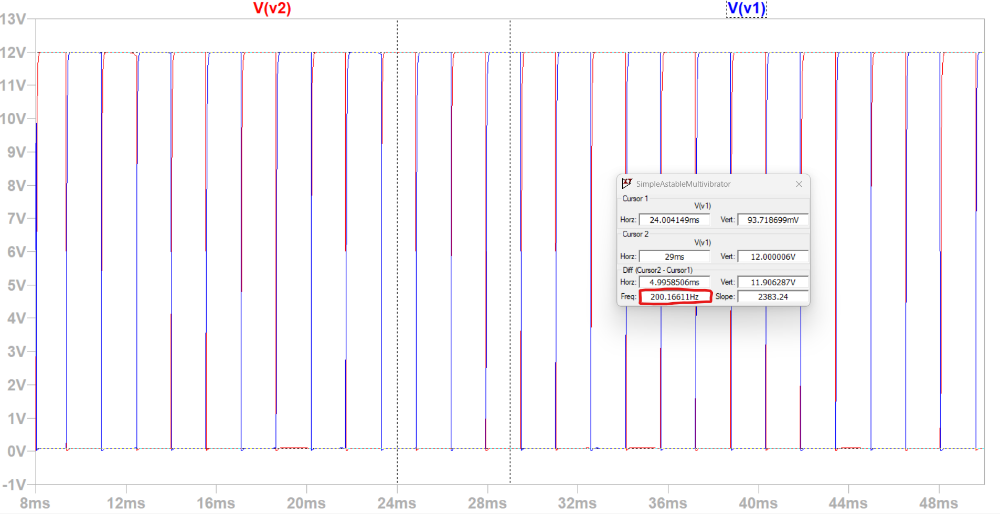
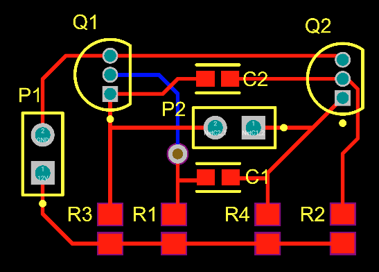

# Simple Astable Multivibrator

## Contents

* [Description](#Description)
* [Circuit Schematic](#Schematic)
* [SPICE-Simulation](#SPICE-Simulation)
* [PCB Layout](#PCB-Layout)
    * [Design Outputs](#Design-Outputs)
* [Credit](#Credit)

## Description

I designed the **Printed Circuit Board (PCB)** for a simple astable multivibrator circuit, which oscillated a **12 V DC** signal between two identical capacitors. Being symmetrically connected to two **NPN** transistors, this produces a square wave output at each collector as they toggle between high and low voltage states.

This project can be viewed in my **Altium** [Workspace](https://muntakim-rahman.365.altium.com/designs/F3E264E5-680A-427F-B278-165C6D4336A3).

## Circuit Schematic

The electrical connections were defined in the [`SimpleAstableMultivibrator.SchDoc`](PCB/SimpleAstableMultivibrator.SchDoc) file.

    

## SPICE Simulation

To determine which capacitances and resistances would produce an output frequency in the audio range (i.e. *20 Hz <= f <= 20 kHz*), a **Simulation Program with Integrated Circuit Emphasis (SPICE)** model was created.

    

From running a **DC** simulation with the expected input voltage, we observed that the *22 nF* capacitors with the *1 kΩ*, *100 kΩ* resistors provided collector output signals at approximately *200 Hz*. This was within our desired range and the circuit required no further changes.

## PCB Layout

From the schematic and desired component traces, the **PCB** layout and routing was configured in the [`SimpleAstableMultivibrator.PcbDoc](PCB/SimpleAstableMultvibrator.PcbDoc) file. The **Design Rule Check** was completed to ensure spacing and routing was performed as intended.

    

### Design Outputs

The **Gerber** files are located in the [`Release/FAB.../Gerber`](Release/FAB-SimpleAstableMultivibrator-A.2/Gerber) directory.

## Credit

This assignment was completed by Muntakim Rahman in the <b>ELEC 391 - Electrical Engineering Design Studio II</b> course, as part of <b>The University of British Columbia Electrical and Computer Engineering</b> undergraduate program.
